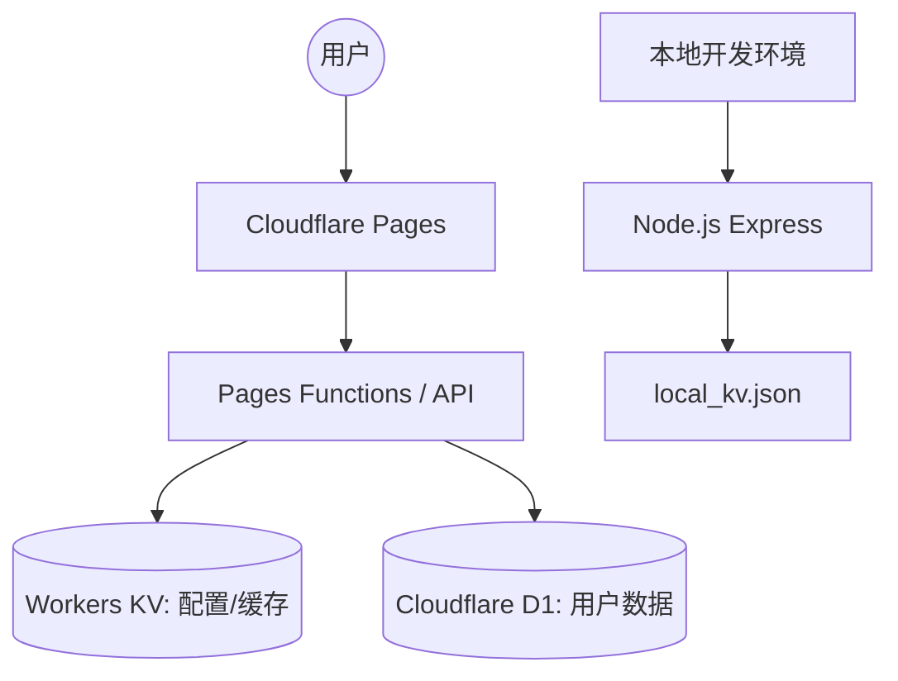

# 🚀 高度自定义高颜值导航网站

[](LICENSE)
[](https://www.cloudflare.com/)
[]()

这是一个具有超强自适应性、高辨识度视觉设计、支持实时自定义编辑的极致导航网站。本项目支持 **Cloudflare Pages + Workers KV** 无服务器极速部署，同时也自带本地 Node.js 离线开发模拟服务，为您实现“线上线下、一键全通”的无缝体验。 

> [!TIP]
> 本项目是在 `880824` 同志的 `cloudflare-nav` [项目地址](https://github.com/880824/cloudflare-nav) 基础上开发的，针对日常使用痛点进行了深度优化。

---

## 🏗️ 系统架构



---

## ✨ 核心亮点与能力

*   **极简主义视觉设计**：支持卡片宽度实时无极微调、经典超清毛玻璃主风格、毛玻璃/卡片背景开关以及自定义高分辨率背景（内置必应每日壁纸缓存自适应获取）。
*   **极致自适应适配**：针对手机端、Pad、超宽显示器深度自适应适配，包括移动端独立行表单、搜索引擎 Tab 自适应折行，以及更小的卡片圆角和紧凑间距，极致触觉体验。
*   **无需数据库的持久化**：生产环境对接 Cloudflare Workers KV 空间，本地开发模式采用精简本地 JSON 模拟 KV 写入，逻辑无缝匹配。

### 🛠️ 相比原版增加的功能：
- **增加搜索框**：搜索框可选内置三个搜索引擎可用于搜索本站内容和外部网站。
- **极简沉浸模式**：深度优化的沉浸式体验。
- **返回顶部/底部**：增加悬浮按钮，避免长页面滑动疲劳。
- **自定义跳转**：支持设置链接在当前页或新页面打开。
- **导航交互 v2.5**：统一搜索框位置，新增“内置搜索”锚点，优化滚动算法。
- **图标自愈 v2.5**：稳健的 6 级降级逻辑，解决 GFW 环境下图标显示问题。
- **图标魔棒工具**：编辑器内一键抓取并自动选择最优可用图标。
- **交互逻辑优化**：全局快捷搜索、侧边栏智能收起、搜索历史回溯。

**本项目地址**：[guide](https://github.com/alivedou/guide)

---

## ☁️ 部署至 Cloudflare Pages 详细步骤

部署本项目需要 `GitHub` 和 `Cloudflare` 账号。

| 平台 | 注册地址 | 登录地址 |
| :--- | :--- | :--- |
| **Cloudflare** | [注册](https://dash.cloudflare.com/sign-up) | [登录](https://dash.cloudflare.com/login) |
| **GitHub** | [注册](https://github.com/signup) | [登录](https://github.com/login) |

### 第一步：创建 Cloudflare Workers KV 空间
1. 登录 [Cloudflare 控制台](https://dash.cloudflare.com/)。
2. 菜单：**存储和数据库** -> **Workers KV** 。
3. 点击 **“创建命名空间”**，命名为 **guide** (或其他自定义名称)。

### 第二步：部署 Cloudflare Pages 项目
1. 将本项目 **fork** 到您的 GitHub 仓库。
   - **项目源码**：[项目地址](https://github.com/alivedou/nav/tree/dev)
2. 在 Cloudflare 点击 **Workers 和 Pages** -> **创建项目** -> **Pages** 标签页。
3. 点击 **“连接到 Git”** 并授权选择您的导航项目仓库。
4. **构建设置** (非常重要)：
   *   **项目名称**：`guide` (或自定义)
   *   **生产分支**：`main`
   *   **框架预设**：`None`
   *   **构建命令**：**留空**
   *   **构建输出目录**：**`public`**
   *   **根目录**：**`nav-main`**
5. 点击 **“保存并部署”**。

### 第三步：绑定 KV 和设置管理员密码
1. 进入 Pages 项目页面，点击 **“设置” (Settings)** -> **“函数” (Functions)**。
2. **KV 命名空间绑定** (需同时添加 Production 和 Preview)：
   *   **变量名称**：**`nav`**
   *   **KV 命名空间**：选择第一步创建的空间。
3. **配置管理员密码**：
   *   在 **设置 (Settings)** -> **环境变量** 下点击 **“添加变量”**。
   *   **变量名**：**`TOKEN`**
   *   **值**：你的管理员密码 (支持明文或 SHA-256 哈希)。
4. **⚠️ 重要**：保存后请前往 **“部署” (Deployments)** 页面，点击最近部署右侧的 `...` 选择 **"重新部署" (Redeploy)**！

---

## 💻 本地开发与预览

### 1. 准备工作
```bash
npm install
```

### 2. 运行模式

| 模式 | 命令 | 说明 |
| :--- | :--- | :--- |
| **数据重置** | `npm run clean` | 【慎用】清空本地所有测试数据 (KV & D1) |
| **快速开发** | `npm run dev` | 使用 Node.js 运行，支持热重载，效率最高 |
| **环境预览** | `npm run preview` | 模拟真实的 Pages 运行环境 (Wrangler) |
| **数据库迁移** | `npm run db:migrate` | 初始化或更新本地 D1 数据库结构 |
| **代码规范** | `npm run format` / `lint` | 自动格式化代码及质量检查 |

> [!IMPORTANT]
> **环境数据隔离说明**:
> - **快速开发 (Node.js)**: 数据存储在根目录的 `local_d1.db` (数据库) 和 `local_kv/` (配置文件)。
> - **环境预览 (Wrangler)**: 数据存储在 `.wrangler/` 隐藏目录下，与 Node 环境完全隔离。
> - 如果您在 `npm run dev` 模式下删库，只需重启服务，系统会自动根据 `migrations/0000_init.sql` 进行自愈初始化。

### 3. 设置管理员密码（本地）
复制根目录下的 `.env.example` 并重命名为 `.env`，定义 `TOKEN` 变量。程序默认在 `http://localhost:3000` 启动，并读取 `kv_mock.json`。

---

## 📂 项目结构预览

```text
├── README.md               # 项目部署手册
├── .env.example            # 环境变量配置样本
├── server.js               # 本地 Web/Express API KV 模拟后端
├── kv_mock.json            # 本地保存的 JSON 数据仓库
└── nav-main/               # 部署云端的主体核心子目录
    ├── functions/          # Cloudflare Pages Serverless 核心逻辑
    │   └── api/
    │       ├── config.js   # 动态鉴权、防泄露、必应壁纸注入逻辑
    │       └── defaultData.js # 默认初始网站和设置库
    └── public/             # 纯前端界面资产
        ├── assets/
        │   ├── css/style.css # 高定制样式引擎
        │   └── js/app.js     # 业务主逻辑
        └── index.html      # 静态主页面
```

---

## ✉️ 系统异常告警与审计通知配置及测试指南

为了保障多用户导航系统的安全性和可观测性，系统内置了强大的**异常即时告警 (Exception Alerts)**与**每日审计日报定时分发 (Daily Audit Digest)**功能。可以通过以下指南配置和本地测试：

### 1. 本地 WSL 开发环境测试

由于本地环境通常不配备真实发信密钥，我们在 [server.js](server.js) 中内置了 **“WSL 控制台仿真打印”** 机制，可以零门槛完美闭环测试：

1. **绑定个人邮箱**：点击左下角高颜值的**用户卡片**打开“个人资料中心”，输入邮箱（如 `admin@example.com`）并确认保存。
2. **管理员授权通知**：进入**系统配置** -> **角色授权**菜单，搜索您的用户名。此时会展示您绑定的邮箱。勾选 `[x] 紧急告警` 与 `[x] 审计日报`，输入管理员密码进行二次核验并确认保存。
3. **模拟危险操作（生成审计日志）**：在管理后台随意修改一些站点配置、隐藏某个分类或删除网址项目。
4. **手动触发日报投递**：在浏览器直接访问本地端点：`http://localhost:3000/api/admin/cron-digest`。
5. **控制台见证奇迹**：回到 WSL 运行 `npm run dev` 的命令行终端，系统会将过去 24 小时内增量的全部审计日志编译，并以美观排版的 Markdown 格式**直接打印输出在 WSL 控制台终端上**。

### 2. 即时异常告警触发场景

全局未捕获异常已通过 [nav-main/functions/api/_middleware.js](nav-main/functions/api/_middleware.js) 网关无缝接管并分发：
- **触发场景**：边缘节点遇到严重的未捕获崩溃或运行时故障（如：D1 数据库连接异常、存储库爆满引发写入中断、Workers KV 连接超时或代码意外运行期崩溃）。
- **非阻塞告警**：崩溃发生时，网关会通过非阻塞线程将堆栈、出错文件、请求路径和客户端 IP 异步分发，网页端显示温和报错，管理员授权邮箱或 Telegram 频道瞬间收到告警。
- **本地测试**：可以在本地故意通过 `throw new Error("D1 物理连接异常丢失")` 抛出错误，或直接临时重命名 `local_d1.db`，请求报错接口即可在 WSL 终端看到紧急告警邮件的抛出打印。

### 3. 每日审计日报 Cron 调度规则

- **触发原理**：在 Cloudflare Pages 生产部署下，日报投递采用标准的 **Cloudflare Workers Scheduled Events (Cron Triggers)**，由边缘定时调起。
- **具体时间配置**：
  - 默认为 **每日 UTC 00:00**（即 **北京时间每日上午 08:00**）由 Cron 触发，将过去 24 小时增量的审计日志打包投递。
  - 在 [wrangler.toml](wrangler.toml) 中可以通过配置 crons 声明定时策略：
    ```toml
    [triggers]
    crons = ["0 0 * * *"] # 对应北京时间 08:00 AM 投递昨日日报
    ```
    或者改为北京时间每日凌晨零点投递：
    ```toml
    [triggers]
    crons = ["0 16 * * *"] # 对应北京时间 24:00 (凌晨 00:00) 投递
    ```

---

## 🔌 浏览器插件配合使用（推荐）

搭配浏览器插件体验更佳（以 Edge 为例）：

1. 在扩展商店搜索并安装 `custom new tab` (作者: `maltejur`)。
2. 安装后在扩展管理中启用。
3. 在插件设置里输入你的导航页网址（自定义域名）。
4. 点击 **Save** 并保存，开启对应按钮。


完成后，浏览器启动页和新建标签页都将自动打开你的私有导航站！🚀
