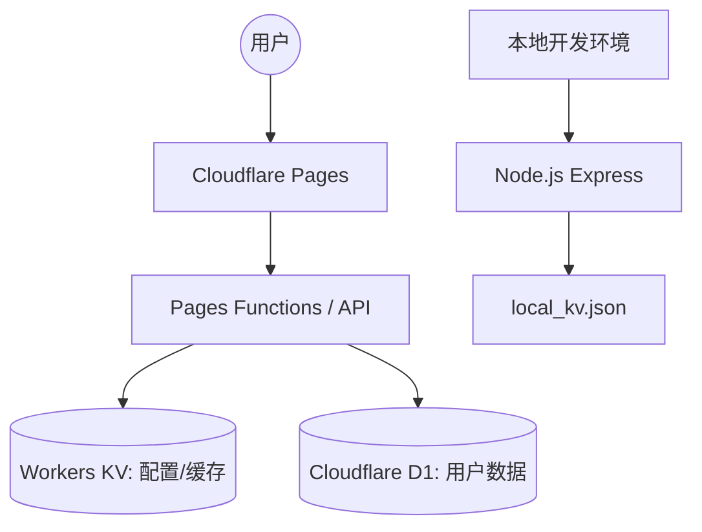

# 🚀 高度自定义高颜值导航网站

[](LICENSE)

[](https://www.cloudflare.com/)

[]()

这是一个具有超强自适应性、高辨识度视觉设计、支持实时自定义编辑的极致导航网站。本项目支持 **Cloudflare Pages +  KV + D1** 无服务器极速部署，同时也自带本地 Node.js 离线开发模拟服务，为您实现“线上线下、一键全通”的无缝体验。

- **本项目地址**：[guide](https://github.com/alivedou/CF-nav/tree/v4)

- **本项目测试地址**：[项目测试地址](https://helyn-hygusfmcja.dcdeploy.cloud/)

- 测试项目由于使用的是没有挂载外部存储的容器部署的，在运营方重启后(运营方经常重启)，数据会丢失，因此:
- **测试项目仅用于操作示范和用户体验**。
- 目前我个人正在使用的版本是用cloudflare pages + kv +d1 使用wrangler部署的,目前已稳定运行超一周。

> [!TIP]
> 本项目是在 `880824` 同志的 `cloudflare-nav` [项目地址](https://github.com/880824/cloudflare-nav) 基础上开发的，针对日常使用痛点进行了深度优化。

---

## 🏗️ 系统架构



---

## ✨ 核心亮点与价值主张

本项目是一个专为高频上网人群、开发者、技术极客量身定制的**多用户高颜值导航系统**。基于 Cloudflare 全家桶（Pages + D1 + KV）实现 **100% 零成本、免服务器、免运维部署**，具备极致的视觉质感与超越普通书签管理器的企业级高级特性。

### 🎨 极致视觉与灵动交互

*   **Aero 磨砂玻璃美学**：拟物化超清毛玻璃（Glassmorphism）风格，支持自定义高分辨率背景（内置 Bing 每日壁纸自动获取）与卡片磨砂背景开关，给您丝滑的护眼享受。

*   **无级微调与个性布局**：卡片宽度实时无极微调、紧凑度（网格密度）自定义，甚至支持自定义链接跳转模式（当前页打开/新窗口打开），打造独一无二的专属仪表盘。

*   **全场景完美自适应**：深度适配手机、平板、带鱼屏等全尺寸设备。移动端定制行表单、搜索引擎 Tab 智能折行，将大屏的华丽与小屏的紧凑完美平衡。

### ⚡ 零门槛零成本云端部署

*   **100% 免费“白嫖”**：基于 Cloudflare Pages 静态托管、Cloudflare D1 边缘 SQLite 数据库与 Workers KV 存储，在完全不花一分钱的前提下获得**百万级并发承载力**。

*   **无数据库运维负担**：数据全球分布式缓存，毫秒级响应，享受极致的边缘计算（Edge Computing）首屏直开快感。

---

## 🛠️ 相比原版：重磅升级与新增功能

针对原版导航的功能痛点与性能瓶颈，我们进行了**脱胎换骨式的重构与高级功能升级**，彻底解决了数据不安全、图标加载慢、只能单人使用等局限性：

### 👥 1. 独创“企业级”多用户系统与权限控制

*   **多用户完全隔离**：支持多用户注册与独立登录，每个用户拥有完全隔离的分类、网址、布局和偏好设置，互不干扰，保护隐私。

*   **精细化角色与配额限制 (Quota)**：内置管理员 (`admin`)、普通用户 (`user`)、受邀用户等权限分发矩阵。针对不同角色分发精细配额（如：系统管理员 150 组分类、普通用户 12 组分类，单分类书签达 25~500 个不等），保护免费边缘服务器资源防止滥用。

*   **闭环邀请码系统**：支持生成邀请码注册机制，精准控制注册客群，一键开启/关闭公共注册。

*   **全局公告系统**：管理员可在后台发布全局公告，支持“强提醒”和“静默通知”模式，用户端自动维护“已读/未读”状态，保证信息精准触达。

### 🚀 2. 独家大文件 IndexedDB 引擎（告警/闪烁全消灭）

*   **突破 5MB 网页存储极限**：将原版不稳定的本地上传限制由 3MB 大幅放宽至 **10MB**。

*   **重构 IndexedDB 底层**：摒弃了易崩溃的 `localStorage`，重构为异步大容量的 `IndexedDB` 存储。首屏预加载极致优化，老缓存无缝向后兼容，实现开屏**零闪烁、零延迟**渲染。

### 🪄 3. 图标智能自愈与“智能魔棒”一键抓取

*   **6 级降级容灾逻辑**：自研高容错图标渲染引擎。在目标网站 CDN 挂掉、HTTPS 证书过期等极端情况下，通过 6 级自动降级机制（获取书签 Favicon、通用备用、首字母头像、底色圆圈等）确保页面永远不出现“破碎图标”。

*   **一键抓取魔棒**：在网址编辑框内，只需输入网址，点击“魔棒”按钮，后台将自动推荐最清晰的 CDN 图标或网络高清图片，免去四处找图标的烦恼。

### 🔍 4. 极致交互与效率工具

*   **万能搜索框与模糊检索**：搜索框内置 Google、Baidu、Bing 等主流搜索引擎，支持 Tab 快速自适应切，更支持**站内书签卡片实时快速模糊检索**，输入字母瞬间直达。
*   **极简禅意沉浸模式**：一键开启禅意空间，聚焦 Spotlight 焦点搜索框，支持全键盘友好响应，在沉浸中追求极致工作流。
*   **悬浮双向触达**：高辨识度悬浮返回顶部/快捷直达底部按钮，避免长列表滑动疲劳。

### 📡 5. 智能监控：异常即时告警与审计日报

*   **非阻塞异步告警**：系统发生异常时，CF Edge 异步分发堆栈，前端展示温和容错，管理员绑定的 **邮箱** 或 **Telegram 频道** 会在瞬间收到即时警报。

*   **安全审计日志**：自动记录敏感操作，并在每日通过邮件/Telegram 发送安全汇总日报。

**本项目地址**：[guide](https://github.com/alivedou/CF-nav/tree/v4)

---
## ☁️ 部署方式一：vps-docker极速部署
具体原理详解在deployment-docker.md有具体说明，只是把手动操作步骤变成了菜单样式的交互命令。
### 最新vps-docker部署方式

极速版两种方式，任选其一：
方式1：
```bash
curl -sSMy https://raw.githubusercontent.com/alivedou/CF-nav/v4/ikun.sh | bash
```
- curl：负责去 GitHub 把你的脚本内容抓下来。

- -sSMy：这是个高阶网络连招。-sS 让下载过程保持安静（不弹进度条）但报错时会说话；-M 和 -y 分别限制了最长连接和传输时间，防止因为网络墙掉导致终端死卡。

- | bash：管道符，意思是把抓下来的脚本内容直接塞给系统的 Bash 解释器去无盘运行，用户本地甚至不需要手动去创建文件。

方式2:
```bash
# 1. 下载脚本
curl -O [https://raw.githubusercontent.com/alivedou/CF-nav/v4/ikun.sh](https://raw.githubusercontent.com/alivedou/CF-nav/v4/ikun.sh)

# 2. 赋予脚本可执行权限
chmod +x ikun.sh

# 3. 启动傻瓜菜单
./ikun.sh
```

## ☁️ 部署方式二：手动部署至 Cloudflare Pages 详细步骤

部署本项目需要 `GitHub` 和 `Cloudflare` 账号。

| 平台 | 注册地址 | 登录地址 |
| :--- | :--- | :--- |
| **Cloudflare** | [注册](https://dash.cloudflare.com/sign-up) | [登录](https://dash.cloudflare.com/login) |
| **GitHub** | [注册](https://github.com/signup) | [登录](https://github.com/login) |

### 第一步：创建 Cloudflare KV 空间与 D1 数据库
1. 登录 [Cloudflare 控制台](https://dash.cloudflare.com/)。
2. **创建 KV 空间**：
   * 菜单：**存储和数据库** -> **Workers KV**。
   * 点击 **“创建命名空间”**，命名为 **guide** (或其他自定义名称)。
3. **创建 D1 数据库**：
   * 菜单：**存储和数据库** -> **D1**。
   * 点击 **“创建数据库”**，选择 **“D1 数据库”**，数据库名称命名为 **cloudnav-db**，点击创建。

### 第二步：部署 Cloudflare Pages 项目
1. 将本项目 **fork** 到您的 GitHub 仓库。
   - **项目源码**：[项目地址](https://github.com/alivedou/CF-nav/tree/v4)
2. 在 Cloudflare 点击 **Workers 和 Pages** -> **创建项目** -> **Pages** 标签页。
3. 点击 **“连接到 Git”** 并授权选择您的导航项目仓库。
4. **构建设置** (非常重要)：
   *   **项目名称**：`mynav` (或自定义)
   *   **生产分支**：`multiple`
   *   **框架预设**：`None`
   *   **构建命令**：`npm install`
   *   **构建输出目录**：**`public`**
   *   **根目录**：**`nav-main`**
5. 点击 **“保存并部署”**（首期部署会因为未绑定资源报错，这是正常的，请继续后面的绑定步骤）。

### 第三步：绑定 KV、D1 数据库与配置环境变量
1. 进入 Pages 项目页面，点击 **“设置” (Settings)** -> **“函数” (Functions)**。
2. **KV 命名空间绑定** (需同时添加 Production 和 Preview)：
   *   **变量名称**：**`nav`**
   *   **KV 命名空间**：选择第一步创建的 KV 空间。
3. **D1 数据库绑定** (需同时添加 Production 和 Preview)：
   *   **变量名称**：**`DB`** (必须大写)
   *   **D1 数据库**：选择第一步创建的 `cloudnav-db` 数据库。
   
4. **配置环境变量**：
   * 在 Pages 项目页面，点击 **设置 (Settings)** -> **环境变量** 下点击 **“添加变量”** (需同时添加 Production 和 Preview)：
   - **必需项**：
     *    **`JWT_SECRET`**：一长串安全随机字符串 (用于 JWT Token 的加解密签名)。
   - **可选项**（用于多人使用时管理网站用）：
     *    **`TELEGRAM_BOT_TOKEN`**：用于日常管理异常通知 (可选项：用于管理员定时日报和异常项目的通知)。
     *    **`TELEGRAM_CHAT_ID`**：填群ID（可选项：若要向多用户私信群发，系统会自动联表读取各用户个人资料自己绑定的 TG_ID；这里的 CHAT_ID 仅用于系统对公共频道或管理大群的广播）。
     *    **`CRON_SECRET`**：一长串安全随机字符串 (可选项：用于管理员定时日报的安全拦截，个人使用的就不需要日报了,主要是管理注册异常用户的操作通知)。
    
-     **PS:** 如需要使用日报功能，请完成 **系统异常告警与审计通知配置及测试指南下** 的第3个步骤操作。

5. **点击保存。**

### 第四步：初始化 D1 数据库表结构 (D1 数据库初始化)
系统基于多用户 D1 关系型 SQLite 运作，在首次运行前必须进行 D1 数据库的表结构初始化。我们为您提供了 **网页端一键导入（小白推荐）** 和 **本地命令行执行（开发者推荐）** 两种方式：

#### 💡 方案 A：网页端控制台一键初始化 (小白极力推荐 🌟)
完全不需要在本地安装任何开发环境、不写任何代码，全部在网页上点点鼠标即可完成！
1. 复制本项目根目录下的 [schema.sql](schema.sql) 文件中的全部 SQL 代码。
   * *(您可以直接在 GitHub 网页上打开并复制该文件)*。
2. 登录 [Cloudflare 控制台](https://dash.cloudflare.com/)，在左侧菜单点击 **“存储和数据库” (Storage & Databases)** -> **“D1”**。
3. 点击您在第一步中创建的 **`cloudnav-db`** 数据库。
4. 切换到顶部的 **“控制台” (Console)** 选项卡。
5. 将刚刚复制的 SQL 代码全部粘贴到控制台的输入框内。
6. 点击 **“执行” (Execute / Run)** 按钮。
7. 看到下方提示执行成功，数据库表就全部创建好了！🎉

#### 💻 方案 B：本地命令行执行迁移 (开发者推荐 🛠️)
如果您已经拉取了代码并在本地进行开发，可以使用 Wrangler 命令行进行数据库迁移：
1. 本地安装依赖：在您的本地工程目录下运行 `npm install`。
2. 登录 Cloudflare 授权：运行 `npx wrangler login`，根据浏览器弹窗提示完成网页登录授权。
3. 执行远程迁移：在本地终端执行下方命令，将 `migrations` 下的所有 SQL 结构依次导入云端 D1 数据库中：
   ```bash
   npx wrangler d1 migrations apply cloudnav-db --remote
   ```
4. 看到控制台输出一系列 `.sql` 脚本迁移成功即可。

### 第五步：重新部署生效
1. 前往 Pages 项目的 **“部署” (Deployments)** 页面。
2. 点击最近一期部署右侧的 `...` 按钮，选择 **“重新部署” (Redeploy)**！
3. 部署完成后，您的多用户高颜值个人导航站即可完美、安全地运行！🚀

---


## 💻 其他内容：本地开发与预览

### 1. 准备工作
需要先下载代码到本地。
```bash
npm install
```

### 2. 运行模式

| 模式 | 命令 | 说明 |
| :--- | :--- | :--- |
| **数据重置** | `npm run clean` | 【慎用】清空本地所有测试数据 (KV & D1) |
| **快速开发** | `npm run dev` | 使用 Node.js 运行，支持热重载，效率最高 |
| **环境预览** | `npm run preview` | 模拟真实的 Pages 运行环境 (Wrangler) |
| **数据库迁移** | `npm run db:migrate` | 初始化或更新本地 D1 数据库结构 |
| **代码规范** | `npm run format` / `lint` | 自动格式化代码及质量检查 |

> [!IMPORTANT]
> **环境数据隔离说明**:
> - **快速开发 (Node.js)**: 数据存储在根目录的 `local_d1.db` (数据库) 和 `local_kv/` (配置文件)。
> - **环境预览 (Wrangler)**: 数据存储在 `.wrangler/` 隐藏目录下，与 Node 环境完全隔离。
> - 如果您在 `npm run dev` 模式下删库，只需重启服务，系统会自动根据 `migrations/0000_init.sql` 进行自愈初始化。

### 3. 设置管理员密码（本地）
复制根目录下的 `.env.example` 并重命名为 `.env`，定义 `TOKEN` 变量。程序默认在 `http://localhost:3000` 启动，并读取 `kv_mock.json`。

---


## 📂 项目结构预览

```text
├── README.md               # 项目部署手册
├── .env.example            # 环境变量配置样本
├── server.js               # 本地 Web/Express API KV 模拟后端
├── kv_mock.json            # 本地保存的 JSON 数据仓库
└── nav-main/               # 部署云端的主体核心子目录
    ├── functions/          # Cloudflare Pages Serverless 核心逻辑
    │   └── api/
    │       ├── config.js   # 动态鉴权、防泄露、必应壁纸注入逻辑
    │       └── defaultData.js # 默认初始网站和设置库
    └── public/             # 纯前端界面资产
        ├── assets/
        │   ├── css/style.css # 高定制样式引擎
        │   └── js/app.js     # 业务主逻辑
        └── index.html      # 静态主页面
```

---

## ✉️ 系统异常告警与审计通知配置及测试指南

为了保障多用户导航系统的安全性和可观测性，系统内置了强大的**异常即时告警 (Exception Alerts)**与**每日审计日报定时分发 (Daily Audit Digest)**功能。可以通过以下指南配置和本地测试：

### 1. 本地 WSL 开发环境测试

由于本地环境通常不配备真实发信密钥，我们在 [server.js](server.js) 中内置了 **“WSL 控制台仿真打印”** 机制，可以零门槛完美闭环测试：

1. **绑定个人邮箱**：点击左下角高颜值的**用户卡片**打开“个人资料中心”，输入邮箱（如 `admin@example.com`）并确认保存。
2. **管理员授权通知**：进入**系统配置** -> **角色授权**菜单，搜索您的用户名。此时会展示您绑定的邮箱。勾选 `[x] 紧急告警` 与 `[x] 审计日报`，输入管理员密码进行二次核验并确认保存。
3. **模拟危险操作（生成审计日志）**：在管理后台随意修改一些站点配置、隐藏某个分类或删除网址项目。
4. **手动触发日报投递**：在浏览器直接访问本地端点：`http://localhost:3000/api/admin/cron-digest`。
5. **控制台见证奇迹**：回到 WSL 运行 `npm run dev` 的命令行终端，系统会将过去 24 小时内增量的全部审计日志编译，并以美观排版的 Markdown 格式**直接打印输出在 WSL 控制台终端上**。

### 2. 即时异常告警触发场景

全局未捕获异常已通过 [nav-main/functions/api/_middleware.js](nav-main/functions/api/_middleware.js) 网关无缝接管并分发：
- **触发场景**：边缘节点遇到严重的未捕获崩溃或运行时故障（如：D1 数据库连接异常、存储库爆满引发写入中断、Workers KV 连接超时或代码意外运行期崩溃）。
- **非阻塞告警**：崩溃发生时，网关会通过非阻塞线程将堆栈、出错文件、请求路径和客户端 IP 异步分发，网页端显示温和报错，管理员授权邮箱或 Telegram 频道瞬间收到告警。
- **本地测试**：可以在本地故意通过 `throw new Error("D1 物理连接异常丢失")` 抛出错误，或直接临时重命名 `local_d1.db`，请求报错接口即可在 WSL 终端看到紧急告警邮件的抛出打印。

### 3. 每日审计日报 Cron 调度与安全规则

- **安全校验机制（`CRON_SECRET` 的作用）**：
  为了防止陌生人恶意访问接口消耗发送配额，`/api/admin/cron-digest` 受到严格的安全密钥拦截。
  * **通关暗号**：外部定时程序（网上闹钟）调用该接口时，必须在 HTTP 请求头（Headers）中加入：
    ```text
    x-cron-secret: <您的 CRON_SECRET 变量值>
    ```
  * 如果没有这个请求头或值不匹配，接口会直接返回 `403 Forbidden`。

- **生产环境定时触发配置方式（免费 Web Cron 定时触发）**：
  由于 Cloudflare Pages 默认只接收 HTTP 请求（不自带自动定时唤醒路由的本地定时器），在生产部署下，请按照以下极简步骤，配置一个免费的“外部网上闹钟”来实现每日自动发送日报（1分钟搞定）：

  1. 注册并登录 [cron-job.org](https://cron-job.org/)（一个专门提供免费、稳定 Web Cron 的良心网站）。
  2. 在其控制台点击 **"Create Cronjob"**（创建定时任务）。
  3. **URL** 填写：`https://你的域名/api/admin/cron-digest`
  4. **Schedule**（执行计划）：选择每天北京时间早上 08:00 执行（或者自定义您喜欢的任何时间，时区选择 `Asia/Shanghai`）。
  5. **Request headers**（请求头设置,在advanced设置里面）：点击添加一行：
     * **Key**：`x-cron-secret`
     * **Value**：填写您在 Cloudflare Pages 后台设置的 **`CRON_SECRET`** 的真实值。
  6. 点击创建。每天到点，它就会自动带上您的专属钥匙叫醒系统，您的邮箱/TG 就能准时收到自检与审计日报了！

---

## 🔌 浏览器插件配合使用（推荐）

搭配浏览器插件体验更佳（以 Edge 为例）：

1. 在扩展商店搜索并安装 `custom new tab` (作者: `maltejur`)。
2. 安装后在扩展管理中启用。
3. 在插件设置里输入你的导航页网址（自定义域名）。
4. 点击 **Save** 并保存，开启对应按钮。


完成后，浏览器启动页和新建标签页都将自动打开你的私有导航站！🚀
